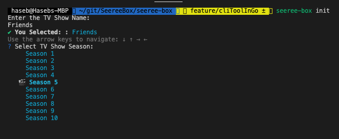

# SeereeBox

The GO CLI toolkit is built using [Cobra](https://github.com/spf13/cobra) library and integrates the API from the [The Movie DataBase (TMDB)](https://www.themoviedb.org/) and hence the credit goes to **Cobra** and **TMDB** for this tool.  

The Command Line Tool has only one simple `command` to start using the funcitonality of the tool and it is;
> `seeree-box init`

> **NOTE:** To come out of the tool execution at any time, simply press `Ctrl + C`

> This will start the toolkit by opening an interactive session with the user by asking the `Enter the TV Show Name` as a freetext input.   
The tootlkit will then show the list of available TV Shows to the user, where then he can select his desired TV Show from the list;   

> This will show to the user all the `Seasons` that are available for the chosen TV Show. 

> Once the user selects the desired `Season`, then the list of `Episodes with the Title` will be shown to the user from that `Season`. The user can pick any `Episode` from the list.

> Finally, the tool allows the user to choose any `Episode` from the shown list and then the console will then show the `Title` and `Summary` of the selected Episode.

